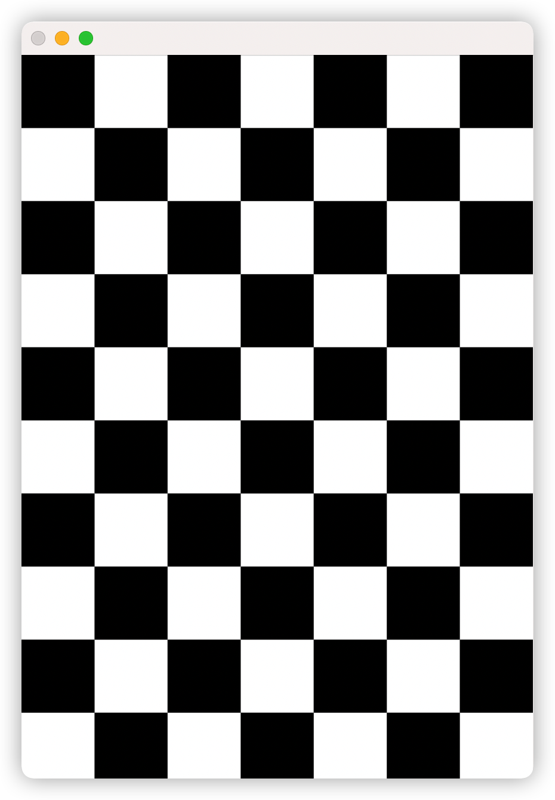
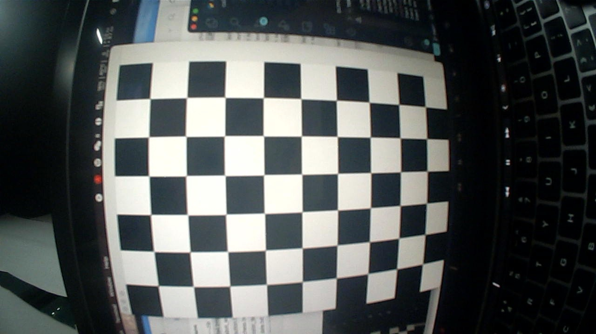

## How to calibrate the camera

Calibration files are required in [calibration_camera](https://github.com/zlj-zz/python-opencv-tutorial/tree/main/calibration_camera) directory. We can see its directory structure:

```
calibration_camera
├── 3a4.bmp
├── calibration.py
├── genrate.py
├── matrix_distortion.npz
├── take_picture.py
└── test_load_calibration_data.py

0 directories, 6 files
```

### 1. Generate grid image

We can run the `generate_grid.py` file to generate the grid image for calibration.

Like this:



### 2. Take calibrate image

You need to use your camera to take pictures of the grid and save them.

The `take_picture.py` file can help you, and you need to save more than 10 photos.

Save photos like this:



### 3. Start calibration

After the preparation, the calibration can be started immediately.

You can run the `calibration.py` to start calibration, then you will look the image like below, and generate the `matrix_distortion.npz` at last.


### 4. Testing

At the last, you can test the data of calibration.

Run the `test_load_calibration_data.py` to load the `matrix_distortion.npz` and open camera to displaying.
