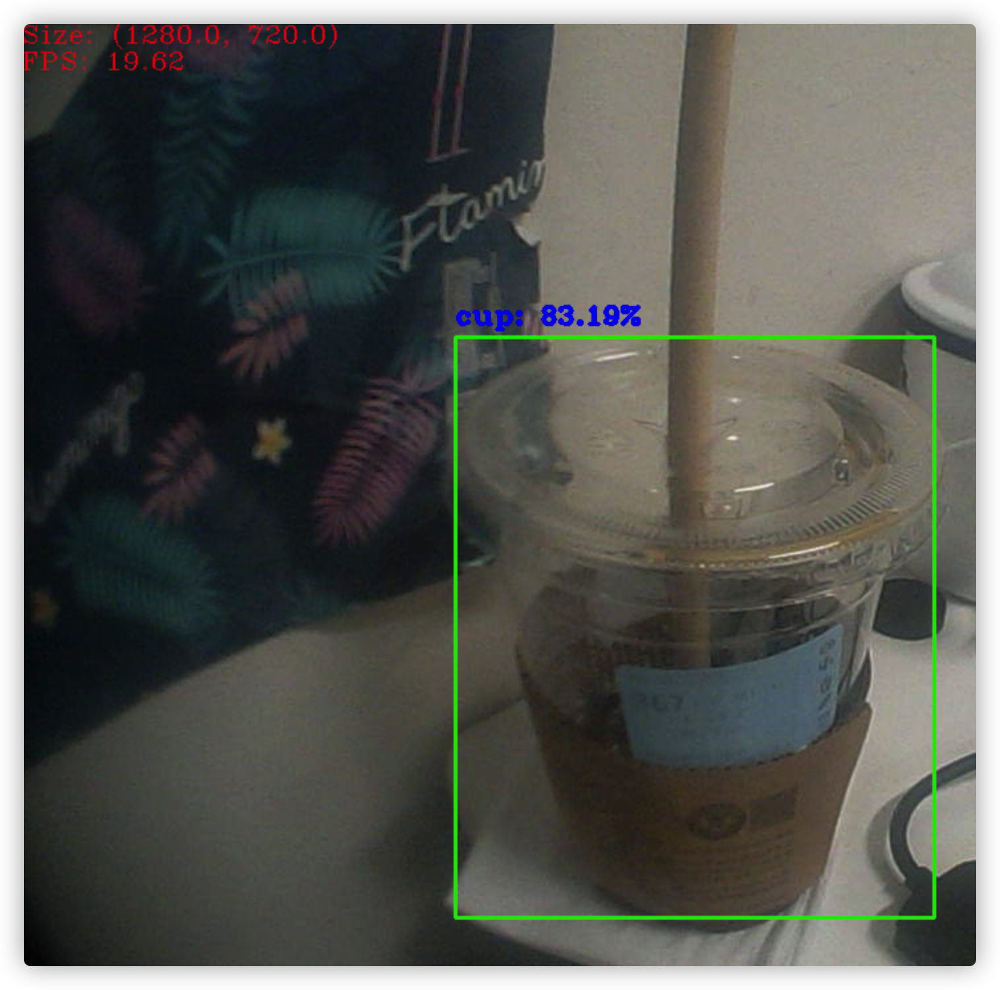

# Object detection by OpenCV

If you want to do object detection, first think of `tensorflow`. So, can OpenCV do it?

This seems unlikely, but since opencv 4, it has been supported to load and use model of  tensorflow.

So first, we need got a tensorflow model. You can training by yourself, also can go to [https://github.com/tensorflow/models/tree/master/research](https://github.com/tensorflow/models/tree/master/research) got a finished model.

Then we can use the `` api to load the model. The api need 2 params, one is the model path, another one is `graph.pbtxt` path. OpenCV provides tools to help us generate it, you can at [https://github.com/opencv/opencv/tree/master/samples/dnn](https://github.com/opencv/opencv/tree/master/samples/dnn) found them.

Using below command to generation:

```bash
python tf_text_graph_ssd.py \
    --input frozen_inference_graph.pb \
    --config ssd_mobilenet_v1_coco.config \
    --output graph.pbtxt
```

So far, we are ready. Next, we start to coding.


```python
...

    # Load class labels.
    labels = load_labels(label_path)
    pprint(labels)

    # Load model.
    if CV_VERSION == 4:
        net = cv.dnn.readNetFromTensorflow(model_path, pbtxt_path)
    else:
        print(
            "Load tensorflow model need opencv 4, your version is {}.".format(CV_VERSION)
        )
        exit(0)

	...

    # Init and open camera.
    cap = cv.VideoCapture(0)
    if not cap.isOpened():
        cap.open()
    cap_size = (cap.get(3), cap.get(4))

    while cv.waitKey(1) < 0:
        start_time = time.time()
        success, frame = cap.read()
        if not success:
            cv.waitKey()
            break

        rows, cols = frame.shape[:-1]

        # Resize image and swap BGR to RGB.
        blob = cv.dnn.blobFromImage(
            frame,
            size=(300, 300),
            mean=(0, 0, 0),
            swapRB=True,
            crop=False,
        )
        # print("First Blob: {}".format(blob.shape))

        # Detecting.
        net.setInput(blob)
        out = net.forward()

        # Processing result.
        for detection in out[0, 0, :, :]:
            score = float(detection[2])
            if score > 0.6:
                # print(detection)
                class_id = detection[1]
                left = detection[3] * cols
                top = detection[4] * rows
                right = detection[5] * cols
                bottom = detection[6] * rows
                cv.rectangle(
                    frame,
                    (int(left), int(top)),
                    (int(right), int(bottom)),
                    (0, 230, 0),
                    thickness=2,
                )
                cv.putText(
                    frame,
                    "{class_name}: {percent}%".format(
                        class_name=id_class_name(class_id, labels),
                        percent=round(score * 100, 2),
                    ),
                    (int(left), int(top) - 10),
                    cv.FONT_HERSHEY_COMPLEX_SMALL,
                    1,
                    (243, 0, 0),
                    2,
                )
	...

```

Through the above part of the code, we can see its core logic, very simple.

Then let's run it, your will see something like this:




I've provided all the files used in this article, which you can find here. [https://github.com/zlj-zz/python-opencv-tutorial/tree/main/object_detection](https://github.com/zlj-zz/python-opencv-tutorial/tree/main/object_detection)
